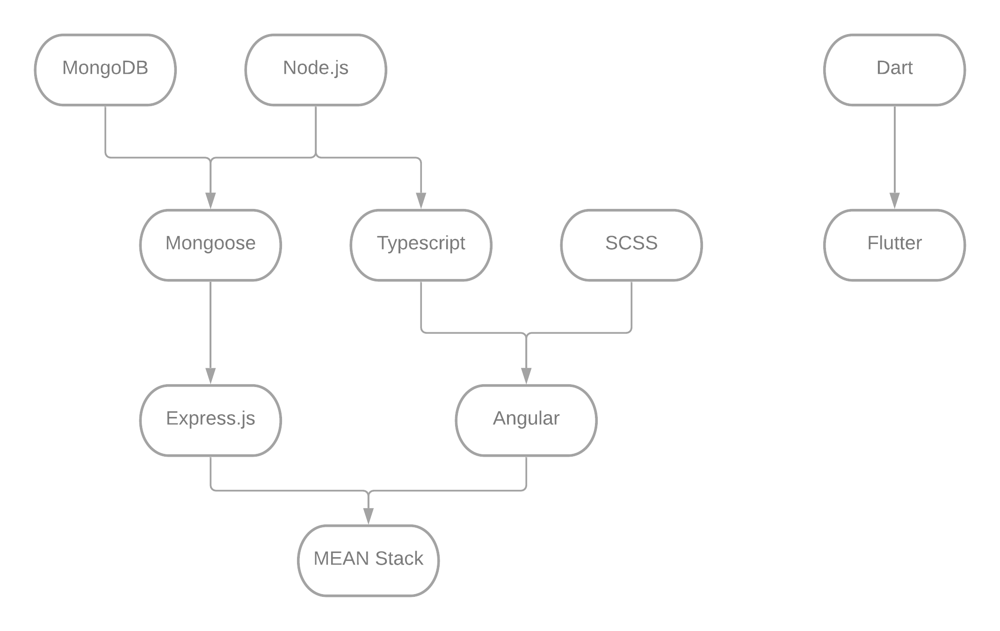

# Paliers
Dans cette section figurera un graphique (prochainement de plus grande taille) indiquant où votre lecture des notes pourrait commencer ainsi que quelle notes vous devriez lire avant quel autre notes. Le but de ceci est d'accommoder le lecteur afin qu'il ne se retrouve pas à débuter certaines notes pour, par la suite, ne rien comprendre à cause de l'usage d'une syntaxe, d'un terme ou d'une méthode qui ne lui est pas familier et qu'il procède par la suite à venir chialer et dire que mes notes "valent pas d'la marde".

